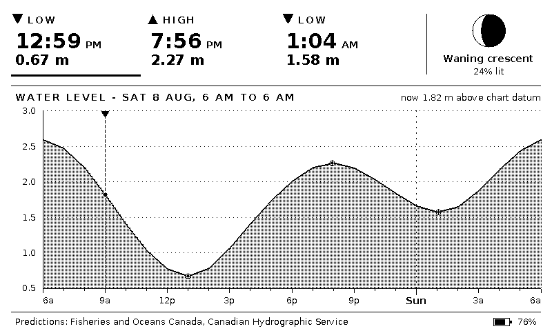
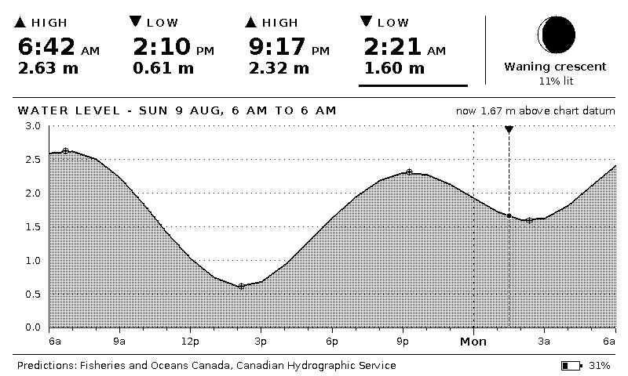
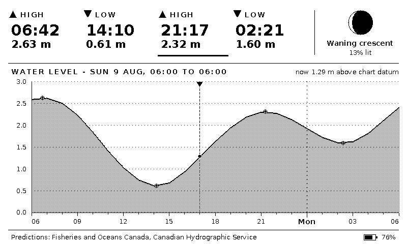
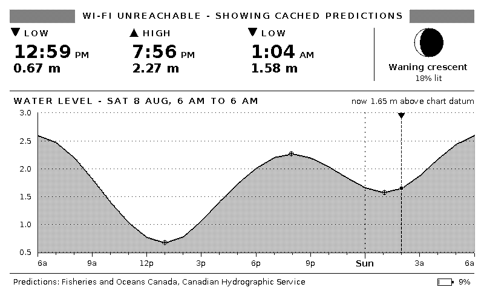

# tideink

A battery-powered tide clock for the [Xteink X4](https://learn.adafruit.com/circuitpython-on-the-xteink-x4-ereader)
e-paper reader. It shows one day of tides for **Charlottetown, PE** — every high
and low, the water level graph they came from, and tonight's moon — using
official predictions from the Canadian Hydrographic Service. It wakes once a
day, downloads and redraws in that one wake, and spends the rest of its life in
deep sleep.



The day runs **6 am to 6 am** rather than midnight to midnight, so the tides you
have not had yet are the ones still on screen when you look at it over breakfast,
and the graph stays put underneath them instead of sliding along with the clock.
A dashed cursor marks the current moment and a bar marks the next tide due.

## Hardware

| | |
|---|---|
| Board | Xteink X4 — ESP32-C3, 16 MB flash, no PSRAM, USB serial/JTAG |
| Panel | 4.26" GDEQ0426T82, 800×480, SSD1677 controller, monochrome |
| Buttons | 7 — power on its own GPIO, six more on two ADC resistor ladders |
| Battery | single LiPo (650 mAh published) on a 2:1 divider; no fuel gauge |
| Power | GPIO13 latches the battery MOSFET — hold it HIGH or it runs on USB only |
| Timekeeping | the C3's internal RTC only — no RTC chip, no 32.768 kHz crystal |
| Framework | Arduino via PlatformIO |

No teardown or hardware modification is needed: the C3 exposes serial over JTAG
through the USB port, so the firmware flashes over the same cable you charge it
with.

[`docs/hardware.md`](docs/hardware.md) documents the pin map, the button ladder
levels, the battery divider and the clock sources, all measured on hardware with
the probe firmware in `src/diag/` (`pio run -e diag -t upload`). Read it before
trusting a published X4 pinout: the widely copied button levels are raw ADC
counts mislabelled as millivolts, and one table lists the X3's I²C bus on pins
that are the battery divider and charge detect here.

## Data source

Predictions come from the **Integrated Water Level System (IWLS)** API run by
Fisheries and Oceans Canada / Canadian Hydrographic Service:

```
https://api-iwls.dfo-mpo.gc.ca/api/v1/stations/{id}/data?time-series-code=...
```

Two series are downloaded per refresh:

- `wlp-hilo` — high and low tide predictions, the row across the top.
- `wlp` — the water level prediction series at hourly resolution, the graph.

The default station is Charlottetown, CHS **01700**, IWLS id
`5cebf1e33d0f4a073c4bc21f` (46.23 °N, 63.12 °W). Heights are metres above chart
datum, the same reference the printed tide tables use.

Point the clock somewhere else by defining `IWLS_STATION_ID`,
`STATION_DISPLAY_NAME` and `LOCAL_TZ` in `src/device/secrets.h`, which is
gitignored and wins over the defaults in
[`src/device/config.h`](src/device/config.h) — handy if you would rather not
commit the tide station at the end of your road. The full station list is at
<https://api-iwls.dfo-mpo.gc.ca/api/v1/stations>.

Only predictions are downloaded, never observations: a tide clock is a
predictions instrument by nature, and predictions are the one series every
station has, including the discontinued gauges.

## Quick start

```sh
pip install platformio

cp src/device/secrets.example.h src/device/secrets.h
$EDITOR src/device/secrets.h        # Wi-Fi SSID, password, optional station

pio run -e x4 -t upload             # flash the X4
pio device monitor                  # optional: watch it boot
```

On first boot it connects to Wi-Fi, sets its clock from NTP, downloads three
days of predictions, draws the screen, and sleeps. If Wi-Fi is not reachable it
says so on screen instead of showing nothing.

### Flashing without the button dance

Deep sleep powers down the ESP32-C3's USB Serial/JTAG peripheral, so a sleeping
clock has no serial port for `esptool` to find, let alone reset — hence the
usual hold-BOOT-tap-RESET routine. `STAY_AWAKE_ON_USB` (default on) avoids it:
whenever the clock finishes a wake cycle with a USB host attached, it waits the
schedule out awake rather than sleeping, so the port stays enumerated and
`pio run -e x4 -t upload` can reset the chip into its bootloader by itself.

The wait is capped at `USB_AWAKE_MAX_MINUTES` (6 hours) rather than running the
full day the schedule now asks for, because the restart at the end of it clears
RTC memory along with the cached predictions — so the cap is also how often a
plugged-in clock re-downloads and redraws.

The clock still has to be *awake* to notice the cable. GPIO20 is the
charge-detect line, and the C3 can only wake from deep sleep on GPIO 0–5, so
plugging in cannot wake it on its own — **tap the front button once** after
connecting. That is an ordinary button press, not the BOOT+RESET combination.
From then on the port stays up until you unplug, and the clock resumes normal
sleeping as soon as the cable comes out.

## Screenshot renders

The UI is the part you iterate on, and reflashing to look at a layout tweak is
miserable. So the drawing code is compiled for the host too, against the same
framebuffer and the same fonts, and dumped to a PNG. What you see in the PNG is
bit-for-bit what the panel gets.

```sh
pio run -e sim -t exec          # render.png from the default fixtures
pio run -e sim -t screenshots   # every state, into docs/screenshots/
pio test -e sim                 # parser and tide model tests
```

The renderer takes a simulated clock and device state, so you can look at any
moment in the tide cycle without waiting for it:

```sh
.pio/build/sim/program \
    --now 2026-08-08T22:30:00Z \
    --battery 9 \
    --banner "WI-FI UNREACHABLE - SHOWING CACHED PREDICTIONS" \
    --out /tmp/late-night.png
```

`--help` lists the rest (`--24h`, `--tz`, `--charging`, `--message`, …).
Fixtures under `test/fixtures/` are unmodified API responses; refresh or
re-capture them with:

```sh
python3 tools/fetch_fixtures.py --from 2026-08-08 --hours 72
```

| | |
|---|---|
|  |  |
|  |  |

## How it runs on a battery

**The clock wakes once a day.** The screen shows a tide day running 6 am to
6 am, so that boundary is the only moment the drawing has to change — and the
single wake that happens there does everything at once:

1. Read the battery divider and the charge-detect pin.
2. Bring up Wi-Fi, sync NTP, download both series, drop the radio.
3. Redraw the panel from the fresh data.
4. Sleep until tomorrow — or, on USB, stay awake instead so the port stays
   flashable (see [Flashing](#flashing-without-the-button-dance)).

That is **one radio session and one full-panel refresh per 24 hours**, and
nothing at all in between. The dataset lives in **RTC memory** (about 1.2 kB —
heights are stored as millimetre integers), so it survives deep sleep and any
wake that does not need the network costs nothing but the boot. Pressing the
front panel button wakes it early and forces a fresh download.

What one wake a day gives up is everything on the screen that follows the clock
rather than the calendar: the cursor on the graph, the `now N.N m above chart
datum` readout, and the bar marking the next tide due are all true at the moment
of the draw and drift through the day. Set `WAKE_FOR_EACH_TIDE` to 1 in
`config.h` to also wake just after every high and low, which keeps that bar
honest at the cost of four or five more panel refreshes a day.

### Waking at the right time without a crystal

The board has no 32.768 kHz crystal, so deep sleep is timed by the C3's internal
RC oscillator, which lands **within about 1%** of the duration it was asked for
(and worse away from room temperature — see
[`docs/hardware.md`](docs/hardware.md)). Over a 24 hour sleep 1% is a quarter of
an hour either way, which is enough to end the sleep *before* 6 am and find
yesterday still on screen.

The clock cannot simply check and go back to sleep, either. The RTC it would
check against is the thing that drifted, so `time()` reads 6 am on the nose
whichever way the oscillator went; only the NTP sync a few seconds into the
refresh reveals that it is really 5:45, by which point the radio session has
been spent. So two things handle it:

- Every sleep is padded by `SLEEP_DRIFT_PERMILLE` (1%) of its own length, which
  buys back the drift and puts the wake on the late side of the moment it was
  aimed at. The screen turns over a quarter of an hour or so after 6 am rather
  than on the dot; that is the price of not paying for a second wake to correct
  the first.
- If the oscillator overshoots even that, the redraw is skipped rather than
  botched. The clock fingerprints what it last put on the panel, and a wake
  whose tide day comes back the same puts the panel down again instead of
  redrawing yesterday and sitting on it for another day.

The same fingerprint is what makes a Wi-Fi outage cheap. A failed refresh
retries every `RETRY_SLEEP_MINUTES` rather than waiting a day, but each retry
draws the *same* "no tide predictions yet" screen — so it is drawn once and the
retries after it leave the panel alone. In simulation, four days of outage cost
three panel refreshes rather than seventy-seven.

### How deep the sleep goes

As deep as it usefully can. Two things look like free current here and are not.

**Forcing power domains off by hand** (`esp_sleep_pd_config`) has nothing left to
switch off. On the C3 the RTC peripherals domain is flagged down on every sleep —
the chip does not even define `SOC_PM_SUPPORT_RTC_PERIPH_PD`, and deep-sleep GPIO
wakeup runs off the always-on pads instead — the 8 MHz oscillator goes down
because the slow clock is the 150 kHz RC one, and XTAL, CPU and flash go down
unconditionally. The one state genuinely below this is ultra-low-power deep
sleep, and the wake button rules that out on its own: an RTC IO cannot be used as
an input in ultra-low mode.

**Hibernating and booting fresh each time** is the sharper idea, because every
scheduled wake brings the radio up for NTP and the download anyway — so what is
the cached data doing? On a good day, nothing: simulated over 60 clean days,
retaining and hibernating are identical, 61 refreshes and 61 radio sessions
either way. But it does not save anything either:

- The memory is powered whether or not the firmware uses it. ESP-IDF turns the
  `AUTO` default for RTC fast memory into `ON` unconditionally, so the
  deep-sleep stub has somewhere to run. The 1.2 kB cache rides along for free.
- The ESP32-C3 datasheet publishes exactly one deep-sleep figure — **5 µA,
  "RTC timer + RTC memory"**, measured with the memory powered — and no
  hibernation figure at all. The next row down is the chip switched off at 1 µA,
  which cannot wake on a timer. So the entire prize is under 4 µA, and really
  much less, since the RTC timer, PMU and RTC watchdog stay up either way.

What the retained memory buys is the panel on the bad days, not the chip on the
good ones. Simulated over 30 days with Wi-Fi down for four of them: retaining
costs 30 panel refreshes, only one of which is the "no tide predictions yet"
placeholder — the rest show yesterday's still-valid predictions under a warning
strip. Hibernating costs 104 refreshes, 76 of them the placeholder. Same for an
oscillator that overshoots the drift pad: 61 refreshes over 60 days retaining,
121 hibernating, because a clock that remembers nothing cannot tell that it has
already drawn today.

`deepSleepFor()` in [`src/device/power.cpp`](src/device/power.cpp) records all of
this next to the code.

**The board's own draw is the part that actually sets the runtime**, and it is
not something firmware can reach. If the battery-sense divider is the 2×10 kΩ the
open-x4 sample firmware describes, it hangs ~195 µA across the cell — around
forty times the sleeping chip, and more than everything the firmware does put
together. That figure is arithmetic from a published resistor value, not a bench
reading; nobody appears to have measured this board's sleep current. Measure it
before optimising anything else.
[`docs/hardware.md`](docs/hardware.md#the-divider-is-probably-what-drains-the-battery)
has the arithmetic, the sources, and what to do about each outcome.

Because the graph is pinned to the day rather than to the download, the
requested window has to reach a full day either side of it: a download landing
a minute before 6 am is already drawing a day that started 24 hours earlier.
That is what `CURVE_HOURS_BEFORE`/`CURVE_HOURS_AFTER` are sized for, and the
slack past that is what lets the clock ride out a day of Wi-Fi outage —
yesterday's download still covers the whole of today's tide day, so the screen
stays right while the hourly retry keeps trying.

If a download fails the previous cache is kept untouched and the screen gets a
warning strip instead.

## Configuration

Everything lives in [`src/device/config.h`](src/device/config.h): station and
time zone, refresh schedule, requested window and resolution, pin map and
battery curve. `secrets.h` is included first, so a `#define` there overrides any
of it without showing up in `git status`.

Both of the settings that used to be guesses have since been measured on
hardware and corrected — `BATTERY_DIVIDER` really is 2.0, and
`CHARGE_ACTIVE_LEVEL` is `HIGH`, not the `LOW` this originally shipped with.
See [`docs/hardware.md`](docs/hardware.md) for the readings.

One finding from that document is worth repeating here, because without it none
of the battery story above is true: **GPIO13 is a battery latch MOSFET, and it
has to be held HIGH — through deep sleep — or the clock only runs on the cable.**
Left floating, unplugging kills the board in about a second while the divider
still reads a full 4.15 V, so it looks like anything but a power problem. The
panel keeps its last image either way, so a dead clock and a working one are
indistinguishable on the shelf.

TLS is not one of them. The API's certificate is verified against the Mozilla
root store that ESP-IDF already ships: `CONFIG_MBEDTLS_CERTIFICATE_BUNDLE_DEFAULT_FULL`
is enabled in the Arduino framework's prebuilt mbedTLS, so roughly 200 roots sit
in `libmbedtls.a` waiting to be referenced. Pointing `setCACertBundle()` at
`_binary_x509_crt_bundle_start` links them in for about 64 kB of flash, and it
keeps working when the API rotates issuers. If a certificate is rejected the
mbedTLS reason is logged over serial, since at the `HTTPClient` level it would
otherwise look like an ordinary connection failure.

## Repository layout

```
lib/tideui/          shared: canvas, fonts, tide model, IWLS parser, screen layout
  src/render.cpp     the entire screen design lives here
  src/moon.cpp       mean synodic moon phase, for the header panel
  src/fonts/         generated bitmap fonts (tools/genfont.py)
src/device/          firmware: panel driver, HTTPS client, power, deep sleep
src/host/            simulator: same renderer, PNG output
test/                native tests and captured API fixtures
tools/               font generation, fixture capture, screenshot batch
```

The split matters: `lib/tideui` has no Arduino dependency, which is what lets
the host and the device share the renderer byte for byte. The device build pulls
in [GxEPD2](https://github.com/ZinggJM/GxEPD2) only for the SSD1677 driver — the
panel gets our own framebuffer directly, so there is no second 48 kB copy and no
Adafruit_GFX in the picture.

## Fonts

`tools/genfont.py` converts DejaVu Sans into the packed 1-bit format the
renderer uses (the same glyph layout Adafruit_GFX uses, with our own structs).
The generated headers are committed, so you only need Pillow and the DejaVu TTFs
if you want to change sizes:

```sh
pip install pillow
python3 tools/genfont.py
```

## Licence

MIT, see [LICENSE](LICENSE). DejaVu fonts are under the Bitstream Vera / DejaVu
licence. Tide predictions are © Fisheries and Oceans Canada, used under the
[Open Government Licence – Canada](https://open.canada.ca/en/open-government-licence-canada).

**Not for navigation.** These are predictions, not observations; actual water
levels vary with weather and barometric pressure.
