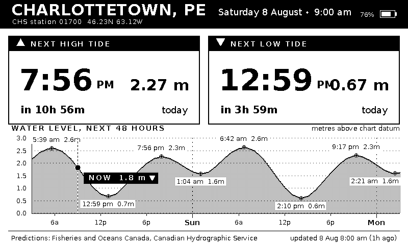
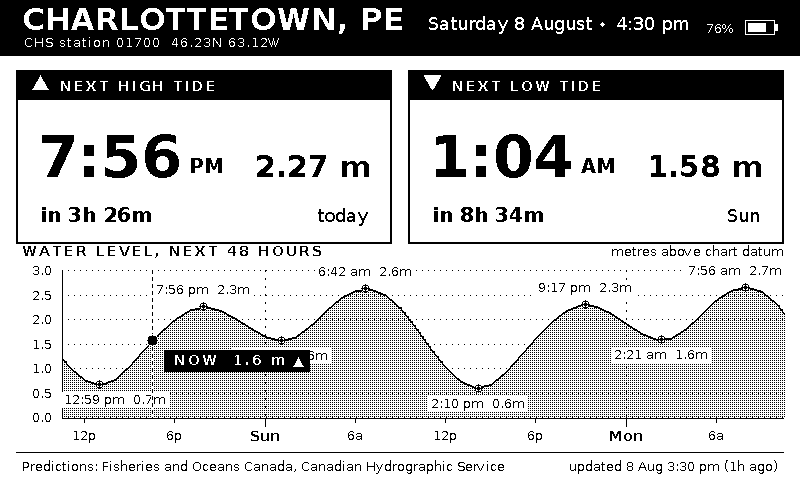
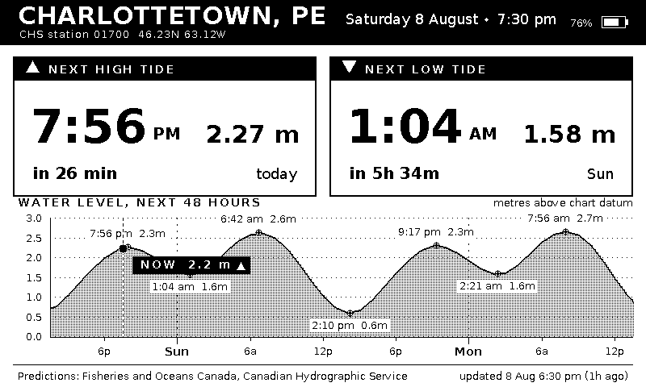
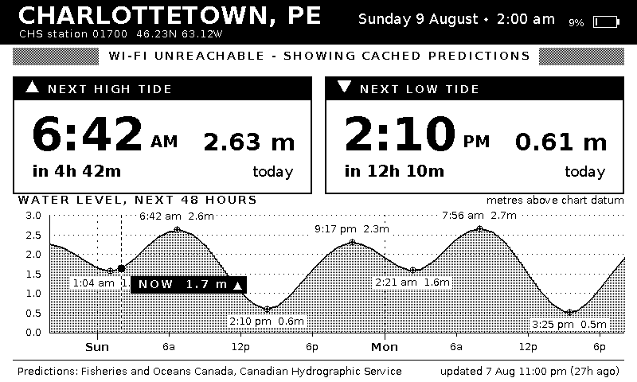

# tideink

A battery-powered tide clock for the [Xteink X4](https://learn.adafruit.com/circuitpython-on-the-xteink-x4-ereader)
e-paper reader. It shows the next high and low tide for **Charlottetown, PE**
plus a 48-hour water level graph, using official predictions from the Canadian
Hydrographic Service. It wakes up a few times a day, downloads once a day, and
spends the rest of its life in deep sleep.



## Hardware

| | |
|---|---|
| Board | Xteink X4 — ESP32-C3, 16 MB flash, USB serial/JTAG |
| Panel | 4.26" GDEQ0426T82, 800×480, SSD1677 controller, monochrome |
| Framework | Arduino via PlatformIO |

No teardown or hardware modification is needed: the C3 exposes serial over JTAG
through the USB port, so the firmware flashes over the same cable you charge it
with.

## Data source

Predictions come from the **Integrated Water Level System (IWLS)** API run by
Fisheries and Oceans Canada / Canadian Hydrographic Service:

```
https://api-iwls.dfo-mpo.gc.ca/api/v1/stations/{id}/data?time-series-code=...
```

Two series are downloaded per refresh:

- `wlp-hilo` — high and low tide predictions, the numbers on the two cards.
- `wlp` — the water level prediction series at hourly resolution, the graph.

The default station is Charlottetown, CHS **01700**, IWLS id
`5cebf1e33d0f4a073c4bc21f` (46.23 °N, 63.12 °W). Heights are metres above chart
datum, the same reference the printed tide tables use.

Point the clock somewhere else by defining `IWLS_STATION_ID`,
`STATION_DISPLAY_NAME`, `STATION_NOTE` and `LOCAL_TZ` in
`src/device/secrets.h`, which is gitignored and wins over the defaults in
[`src/device/config.h`](src/device/config.h) — handy if you would rather not
commit the tide station at the end of your road. The full station list is at
<https://api-iwls.dfo-mpo.gc.ca/api/v1/stations>.

Only predictions are downloaded, never observations: a tide clock is a
predictions instrument by nature, and predictions are the one series every
station has, including the discontinued gauges.

## Quick start

```sh
pip install platformio

cp src/device/secrets.example.h src/device/secrets.h
$EDITOR src/device/secrets.h        # Wi-Fi SSID, password, optional station

pio run -e x4 -t upload             # flash the X4
pio device monitor                  # optional: watch it boot
```

On first boot it connects to Wi-Fi, sets its clock from NTP, downloads three
days of predictions, draws the screen, and sleeps. If Wi-Fi is not reachable it
says so on screen instead of showing nothing.

## Screenshot renders

The UI is the part you iterate on, and reflashing to look at a layout tweak is
miserable. So the drawing code is compiled for the host too, against the same
framebuffer and the same fonts, and dumped to a PNG. What you see in the PNG is
bit-for-bit what the panel gets.

```sh
pio run -e sim -t exec          # render.png from the default fixtures
pio run -e sim -t screenshots   # every state, into docs/screenshots/
pio test -e sim                 # parser and tide model tests
```

The renderer takes a simulated clock and device state, so you can look at any
moment in the tide cycle without waiting for it:

```sh
.pio/build/sim/program \
    --now 2026-08-08T22:30:00Z \
    --battery 9 --banner "WI-FI UNREACHABLE - SHOWING CACHED PREDICTIONS" \
    --out /tmp/late-night.png
```

`--help` lists the rest (`--24h`, `--charging`, `--tz`, `--fetched-ago`,
`--message`, …). Fixtures under `test/fixtures/` are unmodified API responses;
refresh or re-capture them with:

```sh
python3 tools/fetch_fixtures.py --from 2026-08-08 --hours 72
```

| | |
|---|---|
|  |  |
|  |  |

## How it runs on a battery

Every wake-up does the same short sequence and then goes straight back to deep
sleep:

1. Read the battery divider and the charge-detect pin.
2. Decide whether the cached predictions are still usable — is the clock set, is
   the cache younger than `DATA_REFRESH_HOURS`, does it still contain a next
   high, a next low, and a curve covering right now?
3. If not, bring up Wi-Fi, sync NTP, download both series, drop the radio.
4. Redraw the panel from the cache.
5. Sleep until the next interesting moment.

The dataset lives in **RTC memory** (about 1.2 kB — heights are stored as
millimetre integers), so it survives deep sleep and a redraw costs no network at
all. The radio is powered for roughly ten seconds a day.

"The next interesting moment" is whichever comes first of: just after the next
high or low, so the headline cards never point at an event that already
happened; or the next scheduled download. That is clamped to
`[MIN_SLEEP_MINUTES, MAX_SLEEP_MINUTES]` — 15 minutes to 6 hours by default —
which works out to a handful of full-panel refreshes a day. Pressing the front
panel button wakes it early and forces a fresh download.

If a download fails the previous cache is kept untouched and the screen gets a
warning strip instead; the footer always says how old the data is.

## Configuration

Everything lives in [`src/device/config.h`](src/device/config.h): station and
time zone, refresh schedule, requested window and resolution, pin map and
battery curve. `secrets.h` is included first, so a `#define` there overrides any
of it without showing up in `git status`.

Two settings are worth a look before you trust the numbers on the case:

- **`BATTERY_DIVIDER`** — assumed 2.0. If the percentage looks wrong, measure the
  cell and scale it.
- **`CHARGE_ACTIVE_LEVEL`** — GPIO20 is the charge-detect line; the polarity here
  is a guess, so flip it if the bolt icon is inverted on your unit.

TLS is not one of them. The API's certificate is verified against the Mozilla
root store that ESP-IDF already ships: `CONFIG_MBEDTLS_CERTIFICATE_BUNDLE_DEFAULT_FULL`
is enabled in the Arduino framework's prebuilt mbedTLS, so roughly 200 roots sit
in `libmbedtls.a` waiting to be referenced. Pointing `setCACertBundle()` at
`_binary_x509_crt_bundle_start` links them in for about 64 kB of flash, and it
keeps working when the API rotates issuers. If a certificate is rejected the
mbedTLS reason is logged over serial, since at the `HTTPClient` level it would
otherwise look like an ordinary connection failure.

## Repository layout

```
lib/tideui/          shared: canvas, fonts, tide model, IWLS parser, screen layout
  src/render.cpp     the entire screen design lives here
  src/fonts/         generated bitmap fonts (tools/genfont.py)
src/device/          firmware: panel driver, HTTPS client, power, deep sleep
src/host/            simulator: same renderer, PNG output
test/                native tests and captured API fixtures
tools/               font generation, fixture capture, screenshot batch
```

The split matters: `lib/tideui` has no Arduino dependency, which is what lets
the host and the device share the renderer byte for byte. The device build pulls
in [GxEPD2](https://github.com/ZinggJM/GxEPD2) only for the SSD1677 driver — the
panel gets our own framebuffer directly, so there is no second 48 kB copy and no
Adafruit_GFX in the picture.

## Fonts

`tools/genfont.py` converts DejaVu Sans into the packed 1-bit format the
renderer uses (the same glyph layout Adafruit_GFX uses, with our own structs).
The generated headers are committed, so you only need Pillow and the DejaVu TTFs
if you want to change sizes:

```sh
pip install pillow
python3 tools/genfont.py
```

## Licence

MIT, see [LICENSE](LICENSE). DejaVu fonts are under the Bitstream Vera / DejaVu
licence. Tide predictions are © Fisheries and Oceans Canada, used under the
[Open Government Licence – Canada](https://open.canada.ca/en/open-government-licence-canada).

**Not for navigation.** These are predictions, not observations; actual water
levels vary with weather and barometric pressure.
